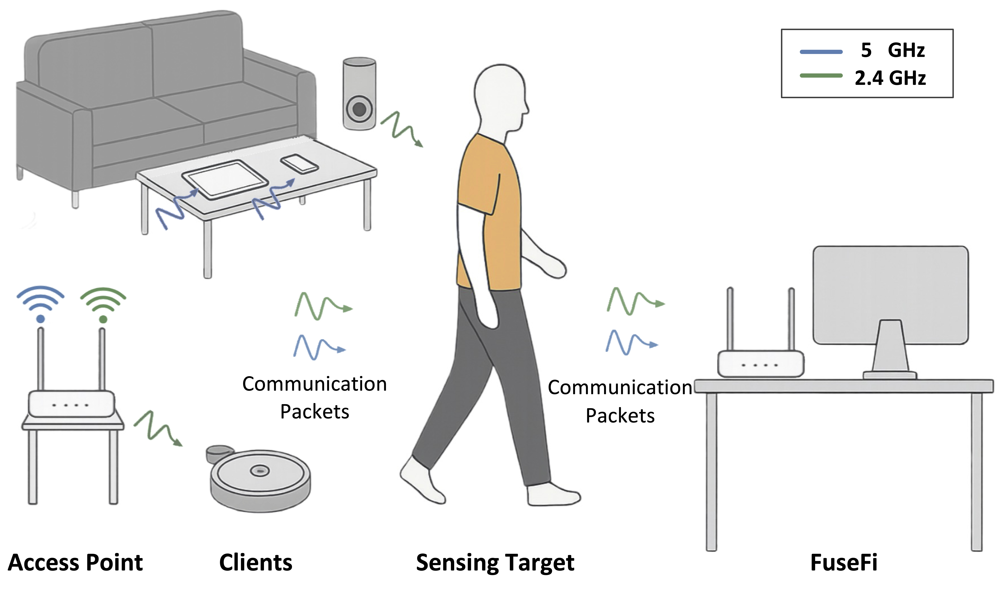
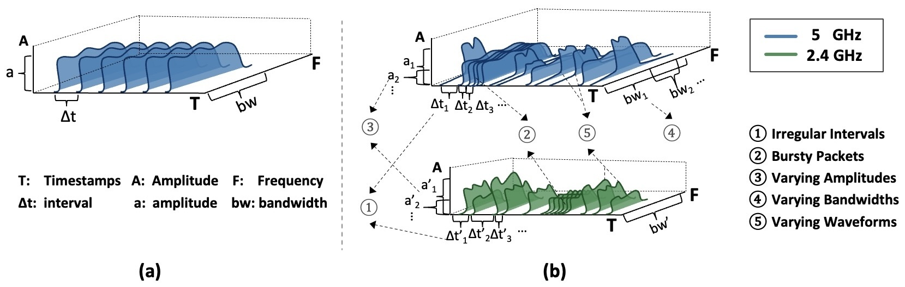

## Abstract

Existing Wi-Fi sensing systems rely on injecting high-rate probing packets to
extract channel state information (CSI), leading to communication degradation
and poor deployability. Although Integrated Sensing and Communication (ISAC) is
a promising direction, existing solutions still rely on auxiliary packet
injection because they exploit only CSI from data frames. We present FuseFi, the
first Wi-Fi-based ISAC framework that fully eliminates intrusive packet
injection by directly exploiting irregularly sampled CSI from diverse
communication packets across multiple frequency bands. FuseFi integrates a CSI
sanitization pipeline to harmonize heterogeneous packets and remove
burst-induced redundancy, together with a time-aware attention model that learns
directly from non-uniform CSI sequences without resampling. We further introduce
CommCSI-HAR, the first dataset with irregularly sampled CSI from real-world
dual-band communication traffic. Extensive evaluations on this dataset and four
public benchmarks show that FuseFi achieves state-of-the-art accuracy with a
compact model size, while fully preserving communication throughput.


## Overview



**Figure 1.** Application scenario. FuseFi uses irregularly sampled CSI from
diverse communication packets across multiple frequency bands for sensing,
operating seamlessly with existing Wi-Fi systems.
{: .caption}



**Figure 2.** CSI comparison: traditional Wi-Fi sensing frameworks vs. FuseFi.
**(a)** Traditional frameworks inject controlled packets for uniform CSI with
constant intervals, bandwidths and amplitudes. **(b)** FuseFi leverages CSI from
multi-band communication packets with irregular intervals, bursty timestamps,
dynamic amplitudes, variable bandwidths and different waveforms.
{: .caption}


**Figure 3.** Architecture. Taking heterogeneous, irregularly sampled CSI
(CommCSI-HAR) as input, FuseFi applies a CSI sanitization pipeline to align
waveforms, remove bursts and select subcarriers. The processed data is then fed
into a time-aware attention network that produces the output for the sensing
task.
{: .caption}

## Code

The repo is on
[GitHub](https://github.com/nesl/FuseFi).


```

## Citation

```bibtex
@article{dong2026fusefi,
  title   = {FuseFi: Combining Irregularly Sampled CSI from Diverse Communication
             Packets and Frequency Bands for Wi-Fi Sensing},
  author  = {Dong, Gaofeng and Yang, Kang and Srivastava, Mani},
  journal = {IEEE Internet of Things Journal},
  year    = {2026}
}
```
